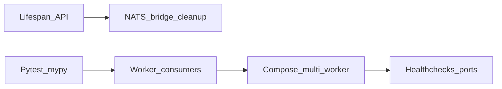

# Финальная ревизия Event Flow Platform

## Текущее состояние (кратко)

- `[src/api/main.py](src/api/main.py)`: используется устаревший `@app.on_event` для NATS bridge; глобальная задача `_ws_bridge_task`.
- `[src/workers/runtime.py](src/workers/runtime.py)`: `fetch_payload()` всегда возвращает `None` — воркеры не читают брокеры.
- `[docker/docker-compose.yml](docker/docker-compose.yml)`: healthcheck API — `curl`; в `[docker/Dockerfile.api](docker/Dockerfile.api)` **curl не установлен** (slim-образ) — вероятная причина «красного» healthcheck в Docker.
- Один сервис `worker` с `[docker/Dockerfile.worker](docker/Dockerfile.worker)` по умолчанию запускает только `email_worker` — остальные воркеры в compose не представлены.
- `[src/services/redis_service.py](src/services/redis_service.py)`: `ping()` через `inspect.isawaitable` (избыточно для redis.asyncio).
- `[tests/conftest.py](tests/conftest.py)`: override БД через `async def _no_db(): yield None` — формально корректно для async dependency; при желании можно явно типизировать как `AsyncGenerator[None, None]`.

---

## Часть 1: Критичные исправления (1–5)

### 1. FastAPI lifespan вместо `on_event`

- Файл: `[src/api/main.py](src/api/main.py)`
- Вынести startup/shutdown в `@asynccontextmanager` `lifespan`, передать в `FastAPI(lifespan=lifespan)`.
- Startup: `configure_logging` (как сейчас до создания app или внутри lifespan — сохранить порядок), затем вызов bridge.
- Shutdown: отмена `asyncio.Task` bridge, **дополнительно**: закрытие NATS-клиента и отписка (см. п.7) — потребует рефакторинга `[start_nats_realtime_bridge](src/api/websocket/notifications.py)` так, чтобы возвращались управляемые ресурсы (client, subscription handle) для `aclose()`/`drain_n`.

### 2. Реальное потребление из брокеров в workers

- База: `[src/workers/runtime.py](src/workers/runtime.py)` — ввести стратегию потребления вместо пустого `fetch_payload`:
  - **Вариант A (предпочтительно):** абстракция `MessageSource` с методом `async def fetch(self) -> dict[str, Any] | None` (или async iterator), подключение в `run()` до цикла, корректный `close()` в `finally`.
- **RabbitMQ** (`[src/services/rabbitmq_service.py](src/services/rabbitmq_service.py)`): после `connect()` + `channel` + `setup_topology` — `queue.consume(callback)` или цикл `iterator` с `process_with_retry` для входящих сообщений (учесть ACK после успешной обработки; NACK/DLQ согласованно с существующей логикой).
- Конкретные воркеры:
  - `[email_worker.py](src/workers/email_worker.py)` — очередь `notifications.email`.
  - `[telegram_worker.py](src/workers/telegram_worker.py)` — `notifications.telegram`.
- **Kafka** (`[src/services/kafka_service.py](src/services/kafka_service.py)`): `[analytics_worker.py](src/workers/analytics_worker.py)` — topic `order.events`, group `analytics-consumer`; `[logger_worker.py](src/workers/logger_worker.py)` — `audit.log`, group `logger-consumer`. Цикл: `await consumer.getmany()` / итерация по сообщениям, commit offset после успеха.
- **Compose:** в `[docker/docker-compose.yml](docker/docker-compose.yml)` добавить отдельные сервисы (или `deploy` с разными `command`/`entrypoint`) для `email`, `telegram`, `analytics`, `logger` на базе одного образа worker с разным `python -m src.workers.`*. Обновить healthcheck на порт соответствующего воркера (8091–8094).

### 3. Docker healthcheck и сеть

- API: заменить проверку на URL, согласованный с внутренним DNS: `http://api:8060/health` **или** `http://127.0.0.1:8060/health` — внутри контейнера `api` оба валидны; если выбран `api:8060`, убедиться, что резолвится (в Compose обычно да).
- **Обязательно:** устранить зависимость от отсутствующего `curl` в образе — либо `RUN apt-get update && apt-get install -y curl` в `[docker/Dockerfile.api](docker/Dockerfile.api)`, либо healthcheck через `python -c` + `urllib.request` (как у worker).
- Worker healthcheck: оставить `localhost:809x` для процесса внутри того же контейнера — корректно; при смене портов — синхронизировать с кодом.

### 4. JWT secret по умолчанию

- `[/.env.example](.env.example)`: комментарий над `JWT_SECRET` — обязательная смена в production, минимальная длина, пример генерации (без реального секрета).
- `[README.md](README.md)`: краткий блок «Security / Production» с тем же предупреждением.

### 5. Redis `ping()`

- `[src/services/redis_service.py](src/services/redis_service.py)`: убрать `inspect`, использовать `return bool(await self._client.ping())` (async redis API).

---

## Часть 1 (продолжение): Важные пункты (6–10)

### 6–7. Kafka consumers + NATS bridge cleanup

- Реализуется в рамках п.2 и п.1: logger/analytics читают Kafka; bridge в lifespan отменяет task и закрывает NATS.

### 8. conftest `get_db_session`

- `[tests/conftest.py](tests/conftest.py)`: явная аннотация `AsyncGenerator[None, None]` для `_no_db` и короткий комментарий, зачем `yield None` (async session dependency без БД в unit-тестах).

### 9. Grafana dashboards

- Файлы: `[docker/grafana/dashboards/*.json](docker/grafana/dashboards/)`
- Расширить панели реальными PromQL под метрики instrumentator (`http_request_duration_seconds_`*, `http_requests_total`) и кастомные метрики из `[src/utils/metrics.py](src/utils/metrics.py)` (`queue_depth`, `error_rate_total`, `orders_`*). При необходимости экспортировать эталонный JSON из Grafana (schemaVersion 38+) и проверить `dashboards.yml` provisioning.

### 10. Load test отчёт

- После успешного `docker compose up` и прогона `[scripts/task.ps1](scripts/task.ps1)` load-test — перегенерировать `[results/benchmark_report.md](results/benchmark_report.md)` и `[results/locust_summary.json](results/locust_summary.json)`.
- Зафиксировать в README: load test требует запущенный API; при отсутствии — ожидаемый connection refused.

---

## Часть 2: Автоматические проверки

Выполнить по очереди (в `.venv` согласно правилам проекта):

- `pytest -v --tb=short`
- `pytest --cov=src --cov-report=term-missing --cov-fail-under=85`
- `black --check src tests`, `isort --check-only .`, `flake8 src tests`, `mypy src`
- `bandit -r src`, `safety check --full-report`

Исправить код/тесты при регрессиях после изменений воркеров и lifespan.

---

## Часть 3: Docker smoke

- `.\scripts\task.ps1 up` — проверить все healthchecks.
- `curl`/браузер: `/health`, `/metrics`, `/docs`, Grafana `:8069`.
- `migrate`, `seed` — CRUD сценарии из задания.

---

## Часть 4: Нагрузочное тестирование

- С запущенным стеком: `.\scripts\task.ps1 load-test` (или параметры `-u 50 -r 10 -t 2m --host http://localhost:8060`).
- Целевые метрики (p95 < 500ms, throughput > 100 rps, error < 1%) — зафиксировать фактические; если не достигнуты — задокументировать как «зависит от железа/конфигурации» и вынести рекомендации в отчёт.

---

## Часть 5: Документация и версия

| Файл                                                                        | Действие                                                                                                                                           |
| --------------------------------------------------------------------------- | -------------------------------------------------------------------------------------------------------------------------------------------------- |
| `[README.md](README.md)`                                                    | Known Issues (deprecation warnings до миграции — убрать после lifespan), troubleshooting, опционально ссылка на Grafana screenshots                |
| `[docs/development.md](docs/development.md)`                                | Отладка: логи контейнеров, типичные ошибки БД/брокеров                                                                                             |
| `[CHANGELOG.md](CHANGELOG.md)`                                              | Запись `[1.1.0]` — финальная ревизия, lifespan, workers, healthchecks, docs                                                                        |
| `[pyproject.toml](pyproject.toml)` / `[.version/VERSION](.version/VERSION)` | Версия **1.1.0**                                                                                                                                   |
| `[docs/architecture.md](docs/architecture.md)`                              | Секция «Lessons learned» (кратко)                                                                                                                  |
| Новые ADR                                                                   | `[docs/adr/005-fastapi-lifespan.md](docs/adr/005-fastapi-lifespan.md)`, `[docs/adr/006-worker-consumption.md](docs/adr/006-worker-consumption.md)` |

---

## Зависимости и риски

- Реализация RabbitMQ/Kafka consume увеличит сложность тестов: моки или integration-marked тесты для consumer loop.
- Множество worker-сервисов увеличит потребление RAM при локальном `docker compose up`.

---

## Уточнения (зафиксировано перед выполнением)

### Workers consumption

- **RabbitMQ:** `async with queue.iterator() as queue_iter` + `async for message in queue_iter`; успех — `await message.ack()`, ошибка — `await message.nack(requeue=True)` (или логика retry/DLQ согласована с заголовками); payload — JSON из `message.body`.
- **Kafka:** цикл `await consumer.getmany(timeout_ms=..., max_records=...)` + парсинг value; после успешной обработки — `await consumer.commit()` (offset).
- **Конфиг очередей/topics:** переменные окружения в `Settings` (`RABBITMQ_CONSUMER_QUEUE`, `KAFKA_CONSUMER_TOPIC`, `KAFKA_CONSUMER_GROUP`) с дефолтами по типу воркера; переопределение в `docker-compose` per-service.
- **ACK/NACK:** см. выше; для Kafka — commit после успешной обработки батча/сообщения.

### Docker healthcheck API

- **Без curl в образе:** healthcheck через `python -c` + `urllib.request` к `http://127.0.0.1:8060/health` (аналогично worker).

### NATS bridge cleanup

- Отмена keepalive-task; `await subscription.drain()` при наличии; `await client.drain()` / `await client.close()` (nats-py).

### Порядок выполнения (подтверждён)

1. Критичные исправления (1–5): lifespan, workers, compose healthcheck, JWT-предупреждения, Redis ping, NATS cleanup.
2. Тесты + линтеры + security.
3. Docker smoke + load test + `results/`.
4. Документация + версия 1.1.0 + ADR 005/006.

