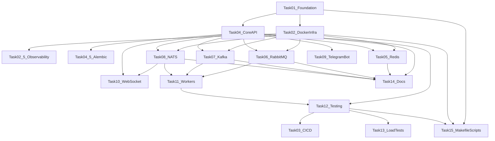

# План работ: Production-ready Event Flow Platform

## Цели и ограничения

- Построить масштабируемую событийную платформу с async-first backend и брокерами сообщений.
- Обеспечить изоляцию Docker-окружения через `COMPOSE_PROJECT_NAME=eventflow` и отдельную сеть/имена контейнеров.
- Использовать **только порты диапазона `806x`** для публичного доступа сервиса проекта.
- Вести версионирование по semver и изменения в `CHANGELOG.md`.

## Базовая схема зависимостей

## Task list

### 1) Foundation и каркас репозитория

- **Описание:** создать структуру каталогов, базовые конфиги Python, линтинга, pre-commit, `.editorconfig`, `.env.example`, `README`, `CHANGELOG`, `ROADMAP`, ADR-шаблоны, `.version/VERSION`.
- **Ожидаемый результат:** репозиторий готов к разработке и онбордингу за 1 день; единый стиль кода; semver-основа.
- **Зависимости:** нет.
- **Оценка:** 4-6 ч.
- **Ключевые артефакты:** `[README.md](README.md)`, `[CHANGELOG.md](CHANGELOG.md)`, `[ROADMAP.md](ROADMAP.md)`, `[pyproject.toml](pyproject.toml)`, `[.env.example](.env.example)`, `[.pre-commit-config.yaml](.pre-commit-config.yaml)`, `[.editorconfig](.editorconfig)`.

### 2) Docker-инфраструктура и порты 806x

- **Описание:** собрать `docker-compose` для API, bot, workers, Redis, RabbitMQ, Kafka+Schema Registry, NATS, Postgres; задать healthchecks, volumes, restart policies, отдельную сеть и `COMPOSE_PROJECT_NAME`.
- **Ожидаемый результат:** `docker compose up` поднимает полностью изолированный стек проекта.
- **Зависимости:** Task 1.
- **Оценка:** 6-8 ч.
- **Порт-план (предложение):**
  - `8060` API (FastAPI)
  - `8061` PostgreSQL
  - `8062` Redis
  - `8063` RabbitMQ AMQP
  - `8064` RabbitMQ Management UI
  - `8065` Kafka broker (external)
  - `8066` Schema Registry
  - `8067` NATS
  - `8068` Prometheus
  - `8069` Grafana
- **Ключевые артефакты:** `[docker/docker-compose.yml](docker/docker-compose.yml)`, `[docker/Dockerfile.api](docker/Dockerfile.api)`, `[docker/Dockerfile.bot](docker/Dockerfile.bot)`, `[docker/Dockerfile.worker](docker/Dockerfile.worker)`.

### 2.5) Prometheus + Grafana (обязательно)

- **Описание:** интегрировать Prometheus и Grafana в compose как обязательные сервисы; подготовить преднастроенные дашборды и datasource provisioning.
- **Ожидаемый результат:** всегда доступные метрики и визуализация состояния платформы.
- **Зависимости:** Task 2, Task 4 (метрики API), Task 6 (метрики очередей).
- **Оценка:** 4-6 ч.
- **Обязательные Grafana-дашборды:** API latency, queue depth, error rate.
- **Ключевые артефакты:** `[docker/docker-compose.yml](docker/docker-compose.yml)`, `[docker/grafana/provisioning/datasources/prometheus.yml](docker/grafana/provisioning/datasources/prometheus.yml)`, `[docker/grafana/provisioning/dashboards/dashboards.yml](docker/grafana/provisioning/dashboards/dashboards.yml)`, `[docker/grafana/dashboards/api-latency.json](docker/grafana/dashboards/api-latency.json)`, `[docker/grafana/dashboards/queue-depth.json](docker/grafana/dashboards/queue-depth.json)`, `[docker/grafana/dashboards/error-rate.json](docker/grafana/dashboards/error-rate.json)`.

### 4) Core FastAPI API + модели данных

- **Описание:** реализовать базовый API (`orders`, `health`, `events`, `metrics`), async SQLAlchemy, pydantic v2 схемы, middleware auth, error handling, graceful shutdown.
- **Ожидаемый результат:** рабочее CRUD API заказов + базовые системные endpoints.
- **Зависимости:** Task 1, Task 2.
- **Оценка:** 8-12 ч.
- **Ключевые артефакты:** `[src/api/main.py](src/api/main.py)`, `[src/api/routes/orders.py](src/api/routes/orders.py)`, `[src/models/order.py](src/models/order.py)`, `[src/models/schemas.py](src/models/schemas.py)`, `[src/config/settings.py](src/config/settings.py)`.

### 4.5) Alembic миграции PostgreSQL

- **Описание:** подключить Alembic для версионирования схемы БД, baseline migration, автогенерацию и ручные ревизии, команды миграции для dev/prod.
- **Ожидаемый результат:** управляемая и воспроизводимая эволюция схемы PostgreSQL.
- **Зависимости:** Task 4.
- **Оценка:** 3-5 ч.
- **Ключевые артефакты:** `[alembic.ini](alembic.ini)`, `[alembic/env.py](alembic/env.py)`, `[alembic/versions](alembic/versions)`, `[scripts/migrate.py](scripts/migrate.py)`.

### 5) Redis: cache-aside + rate limit + blacklist

- **Описание:** интегрировать Redis для кэша `GET /orders/:id` (TTL 300s), sliding-window rate limit 100 req/min/IP, JWT blacklist, health probe.
- **Ожидаемый результат:** ускорение чтений, защита API от спайков, возможность отзыва токенов.
- **Зависимости:** Task 2, Task 4.
- **Оценка:** 6-8 ч.
- **Ключевые артефакты:** `[src/services/redis_service.py](src/services/redis_service.py)`, `[src/api/middleware/rate_limiter.py](src/api/middleware/rate_limiter.py)`, `[src/api/routes/health.py](src/api/routes/health.py)`.

### 6) RabbitMQ: task queues, retry, DLQ, priority

- **Описание:** настроить очереди `orders.pending`, `notifications.email`, `notifications.telegram`, обработку ACK/NACK, retry до 3 с exponential backoff, DLQ, priority queue для VIP.
- **Ожидаемый результат:** надежная асинхронная обработка задач с управляемыми отказами.
- **Зависимости:** Task 2, Task 4.
- **Оценка:** 8-10 ч.
- **Ключевые артефакты:** `[src/services/rabbitmq_service.py](src/services/rabbitmq_service.py)`, `[src/workers/email_worker.py](src/workers/email_worker.py)`, `[src/workers/telegram_worker.py](src/workers/telegram_worker.py)`.

### 7) Kafka: event streaming + audit + consumer groups

- **Описание:** реализовать продюсинг событий в `order.events` и `audit.log`, консюмер-группы `analytics-consumer` и `logger-consumer`, ретеншн 30 дней, Schema Registry.
- **Ожидаемый результат:** устойчивый event stream для аналитики и аудита.
- **Зависимости:** Task 2, Task 4.
- **Оценка:** 8-12 ч.
- **Ключевые артефакты:** `[src/services/kafka_service.py](src/services/kafka_service.py)`, `[src/models/event.py](src/models/event.py)`, `[src/workers/analytics_worker.py](src/workers/analytics_worker.py)`, `[src/workers/logger_worker.py](src/workers/logger_worker.py)`.

### 8) NATS: realtime pub/sub и presence

- **Описание:** подключить NATS каналы `notifications.realtime`, `presence.online`, `system.health`; предусмотреть флаг включения JetStream.
- **Ожидаемый результат:** низколатентные realtime-события и сигнализация состояния сервисов.
- **Зависимости:** Task 2, Task 4.
- **Оценка:** 6-8 ч.
- **Ключевые артефакты:** `[src/services/nats_service.py](src/services/nats_service.py)`, `[src/utils/health.py](src/utils/health.py)`.

### 9) Telegram Bot (aiogram 3)

- **Описание:** реализовать `/start`, `/orders`, `/subscribe`, `/status <order_id>`, inline-кнопки, базовые admin handlers; токен и admin ids брать только из `.env`.
- **Ожидаемый результат:** бот для операторов и пользователей с подписками на статусы заказов.
- **Зависимости:** Task 4, Task 6.
- **Оценка:** 8-10 ч.
- **Ключевые артефакты:** `[src/bot/main.py](src/bot/main.py)`, `[src/bot/handlers/commands.py](src/bot/handlers/commands.py)`, `[src/bot/handlers/admin.py](src/bot/handlers/admin.py)`, `[src/bot/keyboards/inline.py](src/bot/keyboards/inline.py)`, `[.env.example](.env.example)`.

### 10) WebSocket notifications + JWT + rooms

- **Описание:** endpoint `/ws/notifications`, JWT auth, room-based подписка по `order_id`, обработка reconnect на клиентском контракте/серверных heartbeat.
- **Ожидаемый результат:** стабильные realtime-уведомления для UI/операторов.
- **Зависимости:** Task 4, Task 8.
- **Оценка:** 6-8 ч.
- **Ключевые артефакты:** `[src/api/websocket/notifications.py](src/api/websocket/notifications.py)`, `[src/api/routes/events.py](src/api/routes/events.py)`.

### 11) Workers orchestration

- **Описание:** собрать lifecycle и независимый запуск worker-процессов, retry/circuit breaker, идемпотентность обработчиков и корректное завершение по SIGTERM/SIGINT.
- **Ожидаемый результат:** отказоустойчивые воркеры, масштабируемые отдельно от API.
- **Зависимости:** Task 6, Task 7, Task 8.
- **Оценка:** 6-8 ч.
- **Ключевые артефакты:** `[src/workers/email_worker.py](src/workers/email_worker.py)`, `[src/workers/telegram_worker.py](src/workers/telegram_worker.py)`, `[src/workers/logger_worker.py](src/workers/logger_worker.py)`, `[src/workers/analytics_worker.py](src/workers/analytics_worker.py)`.

### 12) Тестирование (unit/integration/E2E)

- **Описание:** покрыть API, сервисы, воркеры и бота; добавить фикстуры, моки брокеров, smoke E2E сценарии; настроить coverage gate 85%+.
- **Ожидаемый результат:** регрессионная защита и проверяемый quality bar.
- **Зависимости:** Task 4-11.
- **Оценка:** 12-16 ч.
- **Ключевые артефакты:** `[tests/conftest.py](tests/conftest.py)`, `[tests/test_api/test_orders.py](tests/test_api/test_orders.py)`, `[tests/test_services/test_redis.py](tests/test_services/test_redis.py)`, `[tests/test_workers/test_workers.py](tests/test_workers/test_workers.py)`, `[tests/test_bot/test_handlers.py](tests/test_bot/test_handlers.py)`.

### 3) CI/CD пайплайны GitHub Actions

- **Описание:** настроить `ci.yml` (lint/test/coverage/security/build) и `cd.yml` (staging deploy + Telegram notify), кэширование зависимостей и docker layers.
- **Ожидаемый результат:** автоматическая проверка качества и деплой в staging.
- **Зависимости:** Task 2, Task 12.
- **Оценка:** 4-6 ч.
- **Ключевые артефакты:** `[.github/workflows/ci.yml](.github/workflows/ci.yml)`, `[.github/workflows/cd.yml](.github/workflows/cd.yml)`.

### 13) Нагрузочное тестирование и отчеты

- **Описание:** реализовать `locust` сценарии (1000 create, 90% cache-hit reads, status updates), сбор p50/p95/p99, throughput и error-rate, генерация отчета.
- **Ожидаемый результат:** воспроизводимые performance-метрики и bottleneck-анализ.
- **Зависимости:** Task 5, Task 11, Task 12.
- **Оценка:** 6-8 ч.
- **Ключевые артефакты:** `[scripts/load_test.py](scripts/load_test.py)`, `[results/benchmark_report.md](results/benchmark_report.md)`, `[scripts/benchmark.py](scripts/benchmark.py)`.

### 14) Документация и ADR

- **Описание:** оформить архитектуру, dev guide, API usage примеры `curl`, ADR 001-004, обновить README/CHANGELOG/ROADMAP и процесс релизов.
- **Ожидаемый результат:** полный набор документации для быстрого онбординга и принятия архитектурных решений.
- **Зависимости:** Task 1-13.
- **Оценка:** 8-10 ч.
- **Ключевые артефакты:** `[docs/architecture.md](docs/architecture.md)`, `[docs/development.md](docs/development.md)`, `[docs/adr/001-redis-caching.md](docs/adr/001-redis-caching.md)`, `[docs/adr/002-rabbitmq-queues.md](docs/adr/002-rabbitmq-queues.md)`, `[docs/adr/003-kafka-events.md](docs/adr/003-kafka-events.md)`, `[docs/adr/004-nats-pubsub.md](docs/adr/004-nats-pubsub.md)`.

### 15) Makefile, scripts и DX-автоматизация

- **Описание:** добавить `make`-команды (up/down/logs/test/lint/format/migrate/seed/load-test/benchmark/docs/version-bump), `scripts/dev.sh`, миграции, сидирование.
- **Ожидаемый результат:** единый developer workflow с быстрым запуском и повторяемостью операций.
- **Зависимости:** Task 1, Task 2, Task 12.
- **Оценка:** 4-6 ч.
- **Доп. требования:** `scripts/seed_data.py` генерирует демонстрационные заказы, пользователей, события и подписки; `scripts/dev.sh` запускает локальную разработку без пересборки Docker.
- **Ключевые артефакты:** `[Makefile](Makefile)`, `[scripts/dev.sh](scripts/dev.sh)`, `[scripts/migrate.py](scripts/migrate.py)`, `[scripts/seed_data.py](scripts/seed_data.py)`, `[.env.example](.env.example)`.

## Утвержденный порядок выполнения

1. Task 01
2. Task 02
3. Task 02.5
4. Task 04
5. Task 04.5
6. Task 05
7. Task 06
8. Task 07
9. Task 08
10. Task 09
11. Task 10
12. Task 11
13. Task 12
14. Task 03
15. Task 13
16. Task 14
17. Task 15

## Критерии готовности (Definition of Done)

- Все сервисы поднимаются через Docker Compose в изолированном проекте.
- Публичные порты строго в диапазоне `8060-8069`.
- API, bot, workers функционируют независимо и совместно.
- `.env.example` содержит `TELEGRAM_BOT_TOKEN` и `TELEGRAM_ADMIN_IDS`.
- Grafana содержит обязательные дашборды: API latency, queue depth, error rate.
- Lint/mypy/tests проходят в CI; coverage >= 85%.
- README и docs позволяют новому разработчику развернуть и понять систему за 1 рабочий день.
- CHANGELOG ведется по релизному процессу semver.

