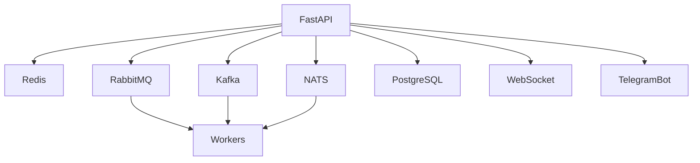

# Event Flow Platform

Production-ready система обработки заказов и событий с FastAPI, Redis, RabbitMQ, Kafka, NATS, PostgreSQL, Telegram Bot и WebSocket-уведомлениями.

## Назначение проекта
- Централизованная обработка жизненного цикла заказов.
- Асинхронная публикация событий в брокеры сообщений.
- Надежная доставка уведомлений и realtime-канал для операторов.

## Быстрый старт
### Linux/macOS
```bash
cp .env.example .env
docker compose -f docker/docker-compose.yml up -d --build
python scripts/migrate.py
python scripts/seed_data.py
```

API: `http://localhost:8060/docs`  
Grafana: `http://localhost:8069`  
Prometheus: `http://localhost:8068`

## Windows (PowerShell, без make)
`make` не требуется. Для Windows используйте `scripts/task.ps1`:

```powershell
.\scripts\task.ps1 up
.\scripts\task.ps1 test
.\scripts\task.ps1 test-cov
```

Опционально можно загрузить алиасы текущей сессии:

```powershell
. .\scripts\aliases.ps1
up
test
test-cov
```

Приоритетные команды:
- Docker: `up`, `down`, `logs`
- Тесты: `test`, `test-cov`
- БД: `migrate`, `seed`
- Нагрузочные: `load-test`, `benchmark`

## Quickstart Checklist (1 day onboarding)
1. Поднять стек через Docker (`up`).
2. Применить миграции и демо-данные (`migrate`, `seed`).
3. Проверить API (`/docs`, `/health`).
4. Проверить realtime контракт (`docs/api/websocket.md`).
5. Пройти тесты и coverage gate (`test-cov`).

## Архитектура


## API endpoints
- `POST /orders`
- `GET /orders`
- `GET /orders/{order_id}`
- `PATCH /orders/{order_id}/status`
- `DELETE /orders/{order_id}`
- `GET /events`
- `GET /health`
- `GET /metrics`

Примеры `curl` см. в `docs/api/openapi.md`.

## Telegram Bot команды
- `/start`
- `/orders`
- `/subscribe`
- `/status <order_id>`
- `/help`

## Безопасность
- JWT-аутентификация.
- **Production:** задайте в `.env` уникальный `JWT_SECRET` (длинная случайная строка, например `openssl rand -hex 32`). Значение по умолчанию `change-me` только для локальной разработки.
- Blacklist токенов через Redis.
- Rate limiting: по умолчанию **100** запросов/мин на IP (`RATE_LIMIT_PER_MINUTE`). Значение **`0` отключает** лимит (удобно для Locust; иначе все запросы с одного хоста быстро получают 429). Подробнее: [`docs/load-testing.md`](docs/load-testing.md).
- Секреты только через `.env`.

## Тестирование
```bash
pytest
```

Нагрузочное тестирование (Locust) и бенчмарк:

```powershell
# Перед прогоном: в .env задайте RATE_LIMIT_PER_MINUTE=0 и перезапустите api (см. docs/load-testing.md)
.\scripts\task.ps1 load-test
.\.venv\Scripts\python.exe scripts\benchmark.py
```

Отчёт: `results/benchmark_report.md`. Подробности сценария, интерпретация 429 и весов задач: [`docs/load-testing.md`](docs/load-testing.md).

## Troubleshooting
- **Docker Compose:** скопируйте `cp .env.example .env` (или `Copy-Item` в PowerShell) — без `.env` compose не поднимет сервисы с `env_file`.
- Если `load-test` падает сразу, убедитесь что API доступен на `http://localhost:8060` после `.\scripts\task.ps1 up`, миграций и `seed`.
- **Locust: почти все запросы с ошибкой 429:** включён rate limit; для нагрузочного теста с хоста задайте `RATE_LIMIT_PER_MINUTE=0` в `.env` и перезапустите сервис `api` (см. [`docs/load-testing.md`](docs/load-testing.md)).
- Если `docker compose up` падает по портам, освободите диапазон `8060-8069`.
- Если Telegram Bot не стартует, проверьте `TELEGRAM_BOT_TOKEN` и `TELEGRAM_ADMIN_IDS`.
- Если CI падает на coverage, запустите `pytest --cov=src --cov-fail-under=85` (исключение `consumer_runner` см. `pyproject.toml`).
- **Grafana:** дашборды ожидают datasource Prometheus с `uid: prometheus` (см. `docker/grafana/provisioning/datasources/prometheus.yml`).
- **RabbitMQ `ACCESS_REFUSED` / воркеры email/telegram падают:** (1) Логин/пароль в `.env` (`RABBITMQ_USER`, `RABBITMQ_PASSWORD`) не должны быть `guest` + произвольный пароль — у встроенного `guest` пароль только `guest`. (2) При `docker compose -f docker/docker-compose.yml` без `--env-file` подстановка `${RABBITMQ_PASSWORD}` в сервис `rabbitmq` **не подхватывает** корневой `.env` (каталог проекта для compose — `docker/`), поэтому брокер мог получить дефолт `eventflow_dev`, а воркеры — ваш пароль из `.env`. Используйте **`docker compose --env-file .env -f docker/docker-compose.yml ...`** или [`scripts/task.ps1`](scripts/task.ps1) (уже с `--env-file`). После смены учётных данных при необходимости удалите том: `docker volume rm eventflow_rabbitmq_data`, затем снова `up`.
- **`safety` и ecdsa:** транзитивная зависимость `python-jose` может помечаться как уязвимая; для production рассмотрите политику игнорирования в CI или смену JWT-библиотеки (см. CHANGELOG 1.1.0).

## Дополнительная документация
- `docs/architecture.md`
- `docs/development.md`
- `docs/load-testing.md`
- `docs/api/openapi.md`
- `docs/api/websocket.md`
- `docs/adr/`
