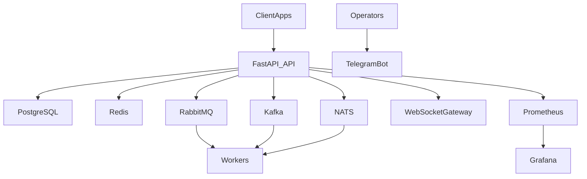
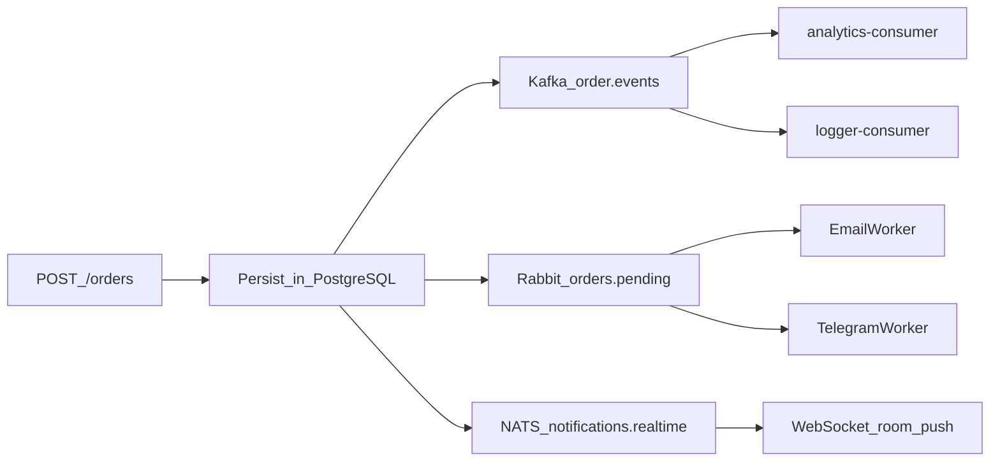

# Architecture

## System context

## Event flow

## Observability
- Prometheus собирает метрики API и инфраструктуры.
- Grafana импортирует dashboards автоматически из `docker/grafana/dashboards`.
- Обязательные панели: API latency, queue depth, error rate.
- Datasource в provisioning задаётся с `uid: prometheus`, чтобы JSON-дашборды ссылались на один и тот же источник.

## Lessons learned (1.1.0)
- Жизненный цикл FastAPI лучше выражать через `lifespan`, а NATS-клиент закрывать через `drain`/`close`, а не только отменой задачи.
- Потребление из брокеров вынесено в отдельный слой (`consumer_runner`); покрытие этого модуля в unit-тестах заменено проверкой в Docker.
