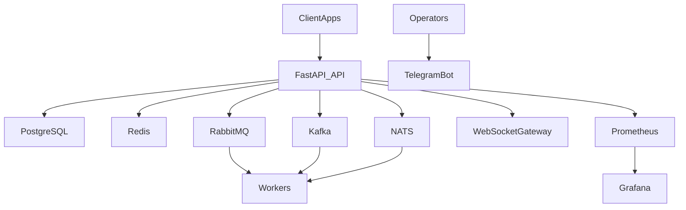
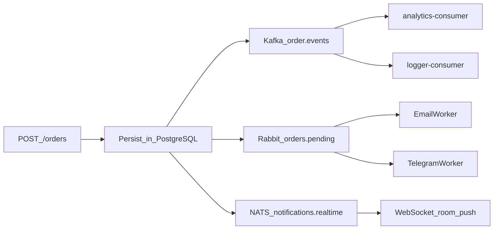

# Architecture

## System context

## Event flow

## Observability
- Prometheus собирает метрики API и инфраструктуры.
- Grafana импортирует dashboards автоматически из `docker/grafana/dashboards`.
- Обязательные панели: API latency, queue depth, error rate.
